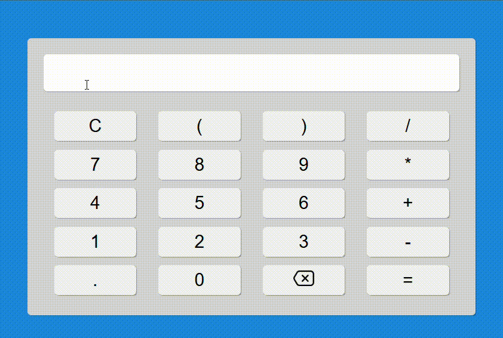

<h1>Calculadora Web</h1>

Esse projeto é uma calculadora Web desenvolvida em HTML, CSS e JavaScript. A calculadora realiza cálculos matemáticos básicos como soma, subtração, multiplicação, etc. a partir das expressões inseridas pelo usuário.

<h2>Tecnologias utilizadas</h2>
<ul>
    <li>HTML
    <li>CSS
    <li>JavaScript
    <li>Visual Studio Code v1.98.2
</ul>

<h2>Estruturas do projeto</h2>
<pre>
WEB-CALCULATOR/
│
├── assets/                 
│   ├── css/                    # Arquivos de estilo da calculadora
│   │   └── style.css       
│   ├── js/                     # Scripts da calculadora
│   │   └── main.js         
│   └── img/                    # Imagens usadas no projeto
│       └── [imagens]
│
└── index.html                  # Página principal do projeto
</pre>
Outros arquivos foram omitidos por não serem relevantes para compreensão da estrutura do projeto.

<h2>Funcionalidades</h2>
<ul>
    <li>A página exibirá uma interface de uma calculadora com botões numéricos e de operações matemáticas.
    <li>Ao clicar nos botões, o usuário poderá realizar cálculos matemáticos básicos, inclusive expressões matemáticas:
        <ul>
            <li>Soma: <code>(+)</code>.
            <li>Subtração: <code>(-)</code>.
            <li>Multiplicação: <code>(*)</code>.
            <li>Divisão: <code>(/)</code>.
            <li>Exponenciação: <code>(**)</code>.
        </ul>
    <li>O botão <code>(=)</code> exibe o resultado da operação.
    <li>O botão <code>(C)</code> limpa o display e renicia o cálculo.
    <li>O botão <code>(«)</code> apaga a última entrada de caracter. 
    <li>Se o cálculo não for possível realizar, um alerta aparecerá informando o usuário.
</ul>

<h2>Demonstração das funcionalidades</h2>

    

<h2>Como rodar o projeto</h2>

Não há necessiadade de instalar nenhuma depedência para rodar o projeto, apenas siga o passo-a-passo a seguir:

<ol>
    <li>Navegue até o repositório pretendido:
    <pre><code>cd caminmho/do/repositorio</code></pre>
    <li>No diretório escolhido, clone o respositório:
    <pre><code>git clone https://github.com/MatheusVenturaNellessen/web-calculator.git</code></pre>
    <li>Abra o arquivo <strong>index.html</strong> em seu navegador e visualize a calculadora.
</ol>

<h2>Contribuições</h2>

Este projeto está aberto para contribuições através de <strong>issues</strong>. Caso você tenha encontrado um bug, queira sugerir uma melhoria ou tenha dúvidas sobre o funcionamento do projeto, por favor, siga as instruções abaixo:

<ol>
    <li>Verifique se já existe uma <strong>issues</strong> da situação aberta. Se já existir, adicione seu comentário na issue existente.
    <li>Caso não tenha sido aberta, crie uma <strong>issues</strong> nova.
</ol>

<h2>Licença e Autor</h2>

Este projeto foi desenvolvido por <a href="https://www.linkedin.com/in/matheus-ventura-nellessen/">Matheus Ventura Nellessen</a> e está licenciado sob a licença MIT. Veja o <a href="./LICENSE">documento</a> para mais detalhe.

